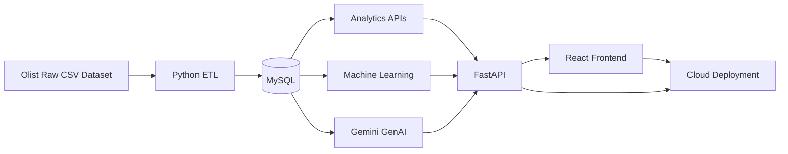

# Customer Intelligence Analytics Platform

> **An end-to-end e-commerce intelligence platform that turns transactional data into customer insights, predictive analytics, and AI-assisted business decisions.**

**Designed & Built by Krishna B M**

🌐 **Live Application:** https://customer-intelligence-platform-7v7w.onrender.com


🔗 **GitHub:** https://github.com/Krishna-Malwad/Customer-Intelligence-Analytics-Platform


⚙️ **API:** https://customer-intelligence-analytics-platform.onrender.com

---

## Overview

The **Customer Intelligence Analytics Platform** is a full-stack analytics and machine-learning application built using the **Olist Brazilian E-Commerce dataset**.

The project takes the complete journey from raw transactional data to a deployed business intelligence platform:

**Raw Data → ETL → MySQL → Analytics → Machine Learning → GenAI → FastAPI → React → Cloud Deployment**

The platform is designed around practical business questions:

* Who are our customers?
* Which customers are high-value or at risk?
* How strong is repeat purchasing?
* Which states have delivery problems?
* Which product categories receive poor ratings?
* What is the expected order value?
* What products could be recommended to customers?
* Can business users ask questions using natural language?

---

## Business Context

The project uses the **Olist Brazilian E-Commerce dataset**, containing approximately 100,000 real orders from 2016–2018.

The data includes:

* Customers
* Orders
* Order items
* Payments
* Reviews
* Products
* Sellers
* Geolocation
* Product-category translations

The objective is not simply to analyze historical data, but to build a reusable analytics system that connects:

**Business Intelligence + Customer Analytics + Machine Learning + Generative AI**

---

## Key Business Metrics

The platform currently surfaces:

| Metric                 |          Result |
| ---------------------- | --------------: |
| Unique customers       |          96,096 |
| Delivered revenue      | R$15,419,773.75 |
| Average order value    |        R$159.83 |
| Average delivery time  |      12.09 days |
| Late-delivery rate     |           8.11% |
| Average review score   |        4.09 / 5 |
| Five-star review share |          57.78% |
| Repeat-purchase rate   |           3.12% |

These metrics are calculated from the project data pipeline and exposed through the backend analytics APIs.

---

## Architecture



### Production architecture

```text
React Frontend
       │
       ▼
FastAPI Backend
       │
 ┌─────┼─────────────┐
 ▼     ▼             ▼
Aiven  ML Models     Gemini
MySQL  (.joblib)     API
```

---

# Platform Features

## 1. Executive Overview

The main dashboard provides a high-level business view including:

* Revenue
* Orders
* Customers
* Average order value
* Revenue trends
* Customer mix
* Delivery health
* Review distribution
* Business attention areas

The purpose is to provide an executive-friendly starting point before moving into deeper analysis.

---

## 2. Customer Intelligence

The customer analytics section provides:

* Customer counts
* Repeat-purchase analysis
* Geographic distribution
* Customer segmentation
* Customer intelligence workflow

The platform follows the journey:

**Observe → Understand → Predict → Act**

---

## 3. Customer 360

The Customer 360 view combines multiple analytical layers for an individual customer.

For a `customer_unique_id`, the platform can provide:

* Customer profile
* Order history
* Delivered orders
* Customer value
* Recency
* Predicted segment
* Retention probability
* Predicted next order value
* Product recommendations
* Generated customer insights

This creates a single customer-level analytical view rather than requiring users to inspect multiple datasets separately.

---

## 4. Operations Analytics

The Operations section focuses on fulfillment and customer satisfaction.

It includes:

* Average delivery time
* Late-delivery rate
* Worst-performing states
* Lowest-rated product categories
* Revenue by product category
* Review performance

Example findings from the dataset include:

* Alagoas has the highest late-delivery rate among the analyzed states.
* `diapers_and_hygiene` has the lowest average review score among the displayed categories.

---

# Machine Learning

The platform contains four ML components.

| Model                 | Approach                     | Result               |
| --------------------- | ---------------------------- | -------------------- |
| Customer Segmentation | KMeans + RFM                 | Silhouette ≈ 0.369  |
| Order Value / CLV     | Random Forest Regression     | R² ≈ 0.229         |
| Retention             | Random Forest Classification | ROC-AUC ≈ 0.618     |
| Recommendations       | Item Co-occurrence           | ~4,058 product pairs |

## Customer Segmentation

Customers are grouped using RFM-style features:

* Recency
* Frequency
* Monetary value

The resulting business-oriented segments include:

* High-Value
* Standard
* At-Risk / Dormant
* Loyal / Repeat

The segmentation model is persisted and loaded by the FastAPI backend rather than retrained for every request.

## Order Value / CLV

The regression model estimates order value using available customer/order features.

The model achieves approximately:

* **R²:** 0.229
* **MAE:** R$92.43
* **RMSE:** R$184.78

This is intentionally reported as a **modest predictive model**, not presented as a highly accurate CLV system.

The dataset contains only a small repeat-purchase signal, which limits the ability to build a strong traditional lifetime-value model.

## Retention Prediction

A Random Forest classifier estimates customer retention probability.

Because repeat purchasing is relatively rare in this dataset, the model uses class balancing.

**ROC-AUC ≈ 0.618**

## Product Recommendations

The recommendation system uses product co-occurrence from customer orders.

It identifies products that frequently appear together and uses these relationships to generate recommendation candidates.

---

# Generative AI

The platform integrates **Google Gemini** for AI-assisted business analysis.

The GenAI layer includes:

### Business Analyst Assistant

Users can ask questions about:

* Revenue
* Customers
* Delivery
* Reviews
* Product categories
* Customer segments

The assistant is designed to ground responses in available platform metrics.

### Automated Insight Generation

The system can transform analytical results into concise business observations and recommendations.

### Report Generation

Analytics can be transformed into structured business-oriented reporting.

### Natural Language → SQL

Users can ask questions in natural language.

Example:

```text
Which states have the highest late-delivery rates?
```

The system can translate the request into SQL, execute it, and return an explanation.

The NL→SQL layer includes a **SELECT-only safety guard** that rejects destructive SQL operations such as:

```text
DROP
DELETE
UPDATE
INSERT
ALTER
TRUNCATE
CREATE
GRANT
```

### Chart Insight Generator

The GenAI layer can generate observations from analytical chart data.

---

# Backend

The backend is built with **FastAPI**.

Important API groups include:

| Endpoint                         | Purpose                            |
| -------------------------------- | ---------------------------------- |
| `/api/health`                  | API, database, ML and GenAI health |
| `/api/customers/{id}`          | Customer 360                       |
| `/api/ml/segment-customer`     | Customer segmentation              |
| `/api/ml/predict-retention`    | Retention prediction               |
| `/api/ml/predict-order-value`  | Order-value prediction             |
| `/api/ml/recommendations/{id}` | Product recommendations            |
| `/api/analytics/overview`      | Executive metrics                  |
| `/api/analytics/revenue-trend` | Revenue trend                      |
| `/api/analytics/customers`     | Customer analytics                 |
| `/api/analytics/products`      | Product analytics                  |
| `/api/analytics/delivery`      | Delivery analytics                 |
| `/api/analytics/satisfaction`  | Customer satisfaction              |
| `/api/genai/ask`               | AI business assistant              |
| `/api/genai/nl-to-sql`         | Natural language → SQL            |
| `/api/data-quality`            | Data quality checks                |

Interactive API documentation is available through FastAPI Swagger UI at:

```text
/api/docs
```

---

# Database

The application uses **MySQL** as the production relational database.

The production schema contains nine core tables:

* customers
* orders
* order_items
* order_payments
* order_reviews
* products
* sellers
* geolocation
* product_category_translation

The production database is hosted using **Aiven MySQL**.

The database design includes primary keys, composite keys, foreign keys, and separate staging/raw structures.

---

# ETL Pipeline

The Python pipeline follows:

```text
Extract
   ↓
Clean
   ↓
Validate
   ↓
Load
```

The pipeline handles:

* Data extraction
* Missing values
* Data-type normalization
* Date handling
* Duplicate handling
* Validation
* Database loading

Database credentials are loaded from environment variables rather than being hardcoded.

---

# Data Quality

The backend exposes live data-quality checks through:

```text
GET /api/data-quality
```

Checks include:

* Null foreign keys
* Duplicate keys
* Invalid date ordering
* Negative prices
* Invalid review scores
* Orphan records
* Empty production tables
* Unexpected status values

---

# Frontend

The frontend is built with:

* React
* JavaScript
* Recharts
* Lucide React
* CSS
* Responsive UI components

Main application areas:

1. **Overview**
2. **Customers**
3. **Customer 360**
4. **Operations**
5. **AI Assistant**
6. **System Health**

The application communicates with the FastAPI backend through HTTP APIs.

---

# Deployment

The application is deployed as separate cloud services.

### Frontend

**Render Static Site**

```text
https://customer-intelligence-platform-7v7w.onrender.com
```

### Backend

**Render Web Service**

```text
https://customer-intelligence-analytics-platform.onrender.com
```

### Database

**Aiven MySQL**

The production database is connected to the FastAPI backend through environment variables and SSL-enabled MySQL connectivity.

### AI

**Google Gemini API**

The Gemini API key is stored as a backend environment variable and is not exposed through the React frontend.

---

# Project Structure

```text
Customer-Intelligence-Analytics-Platform/
│
├── backend/
│   └── app/
│       ├── api/
│       ├── core/
│       ├── services/
│       └── main.py
│
├── frontend/
│   ├── public/
│   ├── src/
│   ├── package.json
│   └── README.md
│
├── Machine_Learning/
│   ├── customer_segmentation.py
│   ├── clv_prediction.py
│   ├── retention_model.py
│   ├── recommendation_system.py
│   └── ml_output/
│
├── GenAI/
│   ├── genai_client.py
│   ├── business_analyst_assistant.py
│   ├── insight_generator.py
│   ├── report_generator.py
│   └── nl_to_sql_assistant.py
│
├── Python/
│   ├── etl_pipeline.py
│   └── cleaning.py
│
├── SQL/
│   ├── schema.sql
│   └── queries/
│
├── Dataset/
│   └── README.md
│
├── Documentation/
│   └── data_dictionary.md
│
├── BI_Exports/
│
├── Dockerfile.backend
├── Dockerfile.frontend
├── docker-compose.yml
├── requirements.txt
├── .env.example
└── README.md
```

---

# Running Locally

## 1. Clone the repository

```bash
git clone https://github.com/Krishna-Malwad/Customer-Intelligence-Analytics-Platform.git

cd Customer-Intelligence-Analytics-Platform
```

## 2. Configure environment variables

Create a local `.env` file from `.env.example`.

```bash
cp .env.example .env
```

Configure the required database and Gemini settings.

> Never commit `.env` or real API keys/passwords to Git.

## 3. Install backend dependencies

```bash
pip install -r backend/requirements.txt
```

## 4. Start FastAPI

```bash
cd backend
uvicorn app.main:app --reload --port 8000
```

Backend:

```text
http://localhost:8000
```

Swagger:

```text
http://localhost:8000/docs
```

## 5. Start React

In a separate terminal:

```bash
cd frontend
npm install
npm start
```

Frontend:

```text
http://localhost:3000
```

---

# Testing

Backend tests are located in:

```text
backend/tests/
```

Run:

```bash
cd backend
pytest tests/ -v
```

The test suite covers:

* Health endpoint
* Customer 360
* ML endpoints
* Analytics endpoints
* Data quality
* NL→SQL safety
* NL→SQL execution path

---

# Security

The project follows several basic production security practices:

* Secrets stored in environment variables
* `.env` excluded from Git
* Gemini API key kept on the backend
* MySQL credentials kept outside source code
* NL→SQL restricted to read-only SQL
* Production database not directly exposed through the frontend
* CORS configured for the deployed frontend
* ML artifacts loaded server-side

---

# Limitations

This project is intentionally transparent about its limitations.

### Limited repeat-purchase signal

The Olist dataset contains relatively few repeat customers, which limits the strength of retention and traditional CLV modeling.

### CLV / Order-value prediction

The regression model has an R² of approximately 0.229. It provides useful experimental signal but should not be treated as a highly accurate financial forecasting model.

### ML version compatibility

The persisted models were trained using scikit-learn 1.8.0 and the production dependency is pinned accordingly. Deployment environments should maintain compatible versions when loading the serialized artifacts.

### Free-tier infrastructure

The deployed application uses free-tier cloud services. Availability, performance, sleep behavior, quotas, and limits may vary by provider and can change over time.

---

# Future Improvements

Potential next steps include:

* Authentication and authorization
* Role-based access control
* Stronger customer retention modeling
* Probabilistic CLV models such as BG/NBD + Gamma-Gamma
* More advanced recommendation algorithms
* Query caching
* Automated CI/CD testing
* Model monitoring
* Feature monitoring
* Better observability and logging
* Additional customer-level predictive features

---

# Technology Stack

| Layer            | Technology                         |
| ---------------- | ---------------------------------- |
| Data             | Olist Brazilian E-Commerce Dataset |
| Database         | MySQL                              |
| ETL              | Python, Pandas                     |
| Analytics        | SQL, Python                        |
| Machine Learning | Scikit-learn                       |
| ML Persistence   | Joblib                             |
| GenAI            | Google Gemini                      |
| Backend          | FastAPI                            |
| Frontend         | React                              |
| Charts           | Recharts                           |
| Deployment       | Render                             |
| Cloud Database   | Aiven MySQL                        |
| Version Control  | Git + GitHub                       |

---

# What This Project Demonstrates

This project demonstrates practical experience across the complete data-product lifecycle:

**Data Engineering**

→ Data cleaning
→ ETL
→ Relational database design
→ Data validation

**Data Analytics**

→ SQL analytics
→ EDA
→ Business KPIs
→ Customer analytics
→ Operations analytics

**Machine Learning**

→ Customer segmentation
→ Classification
→ Regression
→ Recommendation systems

**Generative AI**

→ Business Q&A
→ Natural-language SQL
→ Automated insights
→ Report generation
→ Chart interpretation

**Software Engineering**

→ FastAPI APIs
→ React frontend
→ API integration
→ Environment configuration
→ Security practices

**Deployment**

→ GitHub
→ Render
→ Aiven MySQL
→ Production environment variables
→ Live cloud application

---

## Author

**Krishna B M**

Built as a practical end-to-end data science and software engineering project.

**Live Application:**
https://customer-intelligence-platform-7v7w.onrender.com

**GitHub Repository:**
https://github.com/Krishna-Malwad/Customer-Intelligence-Analytics-Platform
