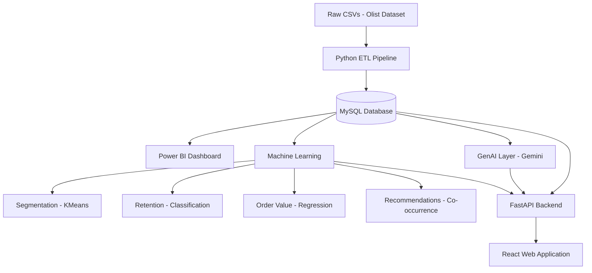

# Customer Intelligence Analytics Platform

An end-to-end e-commerce analytics platform built on the Olist Brazilian
E-Commerce dataset — from raw CSVs through a production MySQL database,
automated ETL, trained ML models, a Gemini-based GenAI layer, a FastAPI
backend, a React web dashboard, and a React web application.

## 1. Business Problem

Olist connects small Brazilian merchants to major marketplaces. This
platform answers the questions a real e-commerce operations/analytics
team asks: Who are our customers? Which ones are likely to leave?
What's a given customer likely worth? What's driving revenue changes?
Where are deliveries failing?

## 2. Architecture



## 3. Dataset

Olist Brazilian E-Commerce dataset — ~100,000 real orders (Sept 2016 –
Aug 2018): customers, orders, order items, payments, reviews, products,
sellers, geolocation.

## 4. Database Design

MySQL database `customer_intelligence`. 9 production tables with proper
primary keys, composite keys (`order_items`, `order_payments`), a
surrogate key (`order_reviews` — no reliable natural key exists), and
foreign keys enforcing referential integrity. Staging (`*_raw`) tables
are separate from production tables. See `SQL/schema.sql`.

## 5. ETL Pipeline

`Python/etl_pipeline.py` — extract → clean → validate → load, fully
automated, reading credentials from `.env`. See `Python/cleaning.py`
for per-table cleaning logic.

## 6. EDA

`EDA/eda_analysis.py` — customer, sales, delivery, and satisfaction
metrics computed directly from the cleaned data.

## 7. Power BI

`React web dashboard` is the intended Power BI report, but the binary PBIX was
not present in either uploaded source ZIP, so it could not be restored into
this final archive. The existing `PowerBI/` data exports and README are
preserved. **Power BI remains the BI/reporting layer** — it is not replaced
by the React app, which serves a different purpose (interactive, API-driven
exploration).

## 8. Machine Learning

| Model | Type | Key metric (honest, unmodified) |
|---|---|---|
| Customer Segmentation | KMeans, RFM features | Silhouette score ≈ 0.369 |
| Order Value / CLV | Regression (Random Forest) | R² ≈ 0.229, MAE ≈ R$92.43, RMSE ≈ R$184.78 |
| Retention | Classification (Random Forest, `class_weight='balanced'`) | ROC-AUC ≈ 0.618 |
| Recommendations | Item co-occurrence | ~4,058 product pairs from ~98,666 orders |

**Honest limitations:** the CLV R² of 0.229 means the model explains
roughly a quarter of order-value variance — real signal, not a strong
predictor. This dataset has only ~3% repeat customers, which limits how
well true lifetime-value or retention modeling can perform; a
classic probabilistic CLV model (BG/NBD) would need more repeat-purchase
history than exists here.

Trained models are persisted with `joblib` to
`Machine_Learning/ml_output/models/` so the API loads them once at
startup rather than retraining per request.

## 9. GenAI Layer

Google Gemini-based (`GenAI/genai_client.py`), five features: Business
Analyst Assistant, Automated Insight Generator, Report Generator,
Natural-Language-to-SQL Assistant (SELECT-only, verified to reject
DROP/DELETE/UPDATE/INSERT/ALTER/TRUNCATE/CREATE/GRANT), and a
vision-based Chart Insight Generator.

## 10. FastAPI Backend

See `backend/app/`. Endpoints:

| Endpoint | Method | Purpose |
|---|---|---|
| `/api/health` | GET | DB connectivity, model load status, GenAI config presence |
| `/api/customers/{id}` | GET | Customer 360 profile (DB + RFM + ML combined) |
| `/api/ml/segment-customer` | POST | Segment prediction from raw RFM input |
| `/api/ml/predict-retention` | POST | Retention probability from raw order features |
| `/api/ml/predict-order-value` | POST | Predicted order value from raw order features |
| `/api/ml/recommendations/{id}` | GET | Product recommendations for a customer |
| `/api/analytics/overview` | GET | Revenue, orders, customers, AOV |
| `/api/analytics/revenue-trend` | GET | Monthly revenue series |
| `/api/analytics/customers` | GET | Customer counts, repeat rate, top states |
| `/api/analytics/products` | GET | Top categories by revenue |
| `/api/analytics/delivery` | GET | Avg delivery time, late rate, worst states |
| `/api/analytics/satisfaction` | GET | Review score distribution, lowest-rated categories |
| `/api/genai/ask` | POST | Free-form business question, answered from real metrics |
| `/api/genai/nl-to-sql` | POST | Natural language → SQL → result → explanation |
| `/api/data-quality` | GET | Live data quality checks |

Interactive docs at `http://localhost:8000/docs` (auto-generated by FastAPI).

**Note on `{customer_id}`:** this refers to `customer_unique_id`, the
real persistent customer identity — Olist generates a new `customer_id`
per order, even for repeat shoppers.

## 11. Customer 360

A single endpoint (`/api/customers/{id}`) combining: order history
stats, RFM, predicted segment, predicted retention probability,
predicted next order value, product recommendations, and generated
insights — all computed live, nothing hardcoded.

## 12. React Dashboard

`frontend/src/App.jsx` — three tabs (Executive Overview, Customer 360
search, Data Quality), each making real `fetch()` calls to the FastAPI
backend. No hardcoded numbers; loading and error states are handled
explicitly.

## 13. Data Quality Monitoring

`GET /api/data-quality` runs 9 real checks: null foreign keys, duplicate
primary keys, invalid date ordering, negative prices, out-of-range
review scores, orphaned records (both directions), non-empty tables,
and unexpected status values.

## 14. Docker

`Dockerfile.backend`, `Dockerfile.frontend`, `docker-compose.yml`
(backend + frontend + MySQL). **Important:** these were written and
reviewed for correctness but **not build-tested** — the development
environment used to build this project did not have a Docker daemon
available. Run `docker compose up --build` yourself and report any
issues.

## 15. Installation

```bash
git clone <your-repo>
cd Customer_Intelligence_Project
cp .env.example .env   # fill in real values
pip install -r backend/requirements.txt
cd frontend && npm install && cd ..
```

## 16. Environment Variables

See `.env.example`. Required: `CI_DB_*` (MySQL), `GEMINI_API_KEY`.

## 17. Running Locally

```bash
# 1. Database (one-time)
mysql -u root -p < SQL/schema.sql
python Python/etl_pipeline.py --data-dir ./Dataset

# 2. Train models (creates the .joblib artifacts the API needs)
python Machine_Learning/customer_segmentation.py --data-dir ./Dataset --k 4 --out-dir ./Machine_Learning/ml_output
python Machine_Learning/clv_prediction.py --data-dir ./Dataset --out-dir ./Machine_Learning/ml_output
python Machine_Learning/retention_model.py --data-dir ./Dataset --out-dir ./Machine_Learning/ml_output
python Machine_Learning/recommendation_system.py --data-dir ./Dataset --out-dir ./Machine_Learning/ml_output --top-n-products 20

# 3. Backend
cd backend && uvicorn app.main:app --reload --port 8000

# 4. Frontend (separate terminal)
cd frontend && npm start
```

## 18. Retraining Models

Re-run any of the 4 scripts in step 2 above whenever the underlying
data changes — each overwrites its own `.joblib` file. The API picks up
the new model on its next restart (models load once at startup).

## 19. Testing

```bash
cd backend
pytest tests/ -v
```

13 tests, covering health, Customer 360 (found + 404), all 4 ML
endpoints, all 6 analytics endpoints, data quality, the NL→SQL safety
guard, and the injected-cursor NL→SQL execution path. The execution-path
test uses a deterministic SELECT smoke test and does not call Gemini.

## 20. Known Limitations

- **No live MySQL in the build/test environment.** All backend testing
  used a SQLite mirror of the real cleaned dataset via FastAPI's
  dependency-override mechanism. This proves the routing, validation,
  and query logic are correct, but your actual MySQL instance has not
  been tested by me directly — please run the test suite again against
  your real database and report results.
- **Docker was not build-tested** (no Docker daemon available while
  building this).
- **The React app's live browser behavior was not visually verified** —
  I confirmed the code is syntactically valid (via a real Babel
  transpile) and the backend integration works over real HTTP, but
  I have no browser to click through the actual rendered UI.
- **GenAI endpoints require your own `GEMINI_API_KEY`** — without one,
  `/api/genai/*` will correctly return a structured 502 error rather
  than crash, but the actual Gemini responses were not exercised live
  in this environment.
- **CLV model has modest predictive power** (R² ≈ 0.23) — reported
  honestly, not hidden.

## 21. Future Improvements

- True probabilistic CLV (BG/NBD + Gamma-Gamma) if more repeat-purchase
  history becomes available
- Authentication/authorization on the API
- Caching layer for expensive analytics queries
- CI pipeline running the test suite automatically
